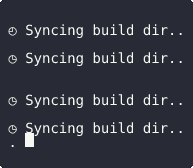

[](https://github.com/mosteo/braillart/actions/workflows/selftest.yml)


# Braillart

**Use Braille patterns as a dot-matrix printer**

Braillart is an Ada library that transforms boolean matrices into text-based
graphics using Unicode Braille characters. Each Braille character acts as a 4×2
dot matrix, allowing the creation of fine-grained visualizations that display
properly in terminals that support Unicode.

Braillart supports output by cell, line, and matrices of arbitrary sizes.

See this falling sand demo:



Usual terminal fonts do not show the unmarked dots, so the effect is better.

You can run it yourself by entering the `demos/sand` directory and running
(with [`alr`](https://github.com/alire-project/alire) in your path):

```bash
$ alr run
```

With [`ansiada`](https://github.com/mosteo/ansi-ada) and braillart you could
create something similar to what [`btop`](https://github.com/aristocratos/btop)
does.

And since with ANSI you are limited to one color per character, you enter kinda
into ZX Spectrum territory, where colors were likewise applied to pixel blocks
rather than in individual pixels.

(Not that this is in any way efficient. I don't really know. Maybe it is.)